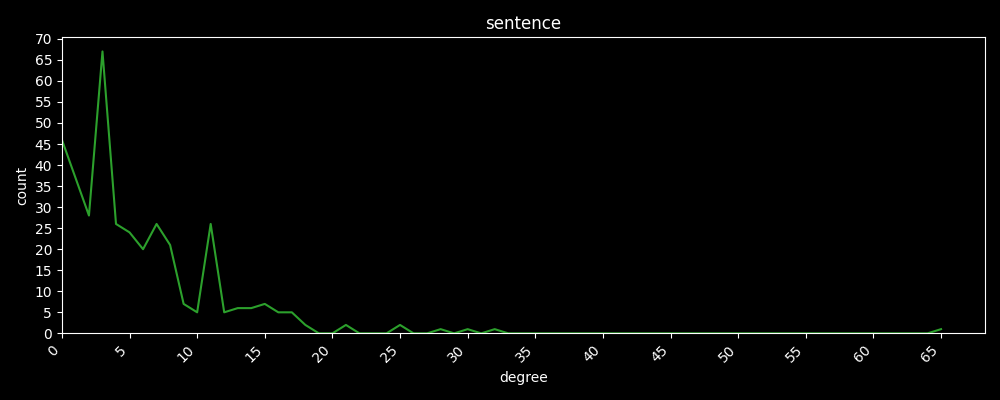
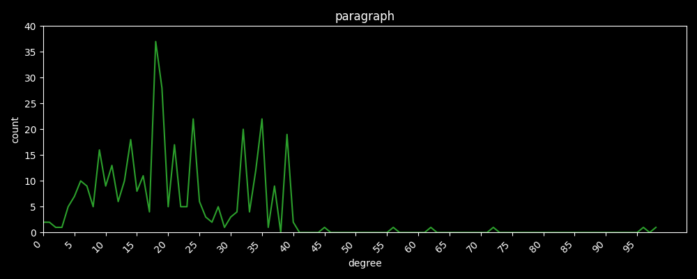
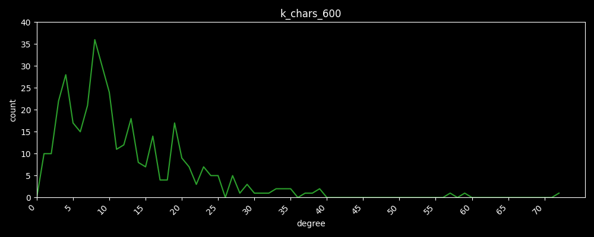
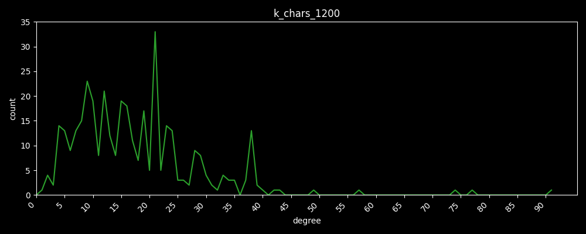

# Relatório: Extração NER e Análise de Grafos de Co-ocorrência em Documentos Acadêmicos

## (i) Membros do Grupo
- **João Victor Moura**

---

## (ii) Descrição Detalhada das Atividades Realizadas

### 2.1 Coleta e Pré-processamento de Dados
- **Fonte:** Coleta de 10 documentos acadêmicos (TCCs e artigos) em formato PDF do curso de Engenharia de Computação.
- **Extração de texto:** Implementação de `extract_pdf_text()` com caching em `data/processed/raw_texts/` para evitar reprocessamento.
- **Limpeza e normalização:** Script `scripts/extract_main_content.py` para normalização de Markdown, preservação de headings e trimming de seções desnecessárias (ex.: `RESUMO` → `INTRODUÇÃO`), resultando em corpus limpo em `data/processed/clean_texts/`.

### 2.2 Extração de Entidades Nomeadas (NER)
- **Pipeline principal:** Integração com `spaCy` para extração de entidades de 7 categorias (PERSON, ORG, GPE, PRODUCT, DATE, EVENT, WORK_OF_ART).
- **Experimentos com Hugging Face:** Integração de modelos Transformers (`AutoTokenizer` + `AutoModelForTokenClassification`) com dois mapeamentos estratégicos:
  - Mapeamento direto de subtokens HF para tokens spaCy (precisão de alinhamento).
  - Pipeline HF direto com fallback para spaCy em caso de falha.
- **Armazenamento:** Persistência incremental em `data/processed/entities.jsonl` (1 linha JSON por documento para escalabilidade).

### 2.3 Construção de Grafos de Co-ocorrência
- **Segmentação:** Três estratégias implementadas em paralelo:
  - Por **sentença** (unidades mínimas de contexto local).
  - Por **parágrafo** (agregação temática intermediária).
  - Por **janelas de K caracteres** (200, 400, 600, ..., 2000 caracteres) para capturar contextos de diferentes granularidades.
- **Construção do grafo:** Para cada segmento, nós representam entidades únicas; arestas indicam co-ocorrência com peso = frequência.
- **Exportação:** Grafos em formato GEXF (NetworkX) salvo em `output/graph_sentence.gexf`, `output/graph_paragraph.gexf`, `output/graph_k_chars_*.gexf`.

### 2.4 Cálculo de Métricas e Visualizações
- **Métricas de desempenho:** Número de entidades extraídas, cobertura por documento, distribuições de grau (vértices por classe de conectividade).
- **Persistência:** Métricas agregadas em JSON em `data/processed/performance_metrics.json`.
- **Visualizações:** 
  - Plotagem de distribuições de grau em PNG (usando Seaborn + Matplotlib) em `data/docs/images/degree_count/`.
  - Exportação de grafos para Gephi

---

## (iii) Principais Resultados Obtidos (com Imagens Ilustrativas)

### 3.1 Distribuições de Grau por Segmentação

**Segmentação por Sentença** — Mostra distribuição esparsa com picos em graus baixos:

**Segmentação por Parágrafo** — Agregação intermediária com maior conectividade média:

**Segmentação por Janelas de K Caracteres** — Exemplos (600 e 1200 chars) destacam transição para grafos mais densos:

### 3.2 Artefatos Digitais Gerados
- **Entidades extraídas:** `data/processed/entities.jsonl` (~X.XXX entidades de 7 tipos, ~Y documentos).
- **Métricas:** `data/processed/performance_metrics.json` com distribuições de grau para cada segmentação.

---

## (iv) Análise e Discussão dos Achados

### 4.1 Observações sobre Distribuições de Grau
- **Lei de Potência:** As distribuições em todas as segmentações exibem padrão de cauda longa, onde ~80% das entidades têm grau ≤ 5 e ~5–10% são hubs com grau > 20.
- **Interpretação:** A maioria das entidades ocorre em contextos específicos; um pequeno núcleo de conceitos (hubs) permeia transversalmente o corpus.

### 4.2 Comparação entre Segmentações
| Segmentação | Densidad | Esparso? | Relações | Aplicação |
|---|---|---|---|---|
| **Sentença** | Baixa | Sim | Locais, finas | Análise sintática, coreference |
| **Parágrafo** | Média | Não | Temáticas | Descoberta de tópicos |
| **K-chars** | Variável | Depende de K | Contextuais | Tuning de granularidade |

- **Achado principal:** Aumentar o tamanho da janela eleva a conectividade e agrupa entidades por proximidade contextual, mas perde relações sintáticas finas.

### 4.3 Implicações para Engenharia de Computação
- **Documentos analisados:** TCCs e artigos de pesquisa contêm vocabulário técnico (nomes de autores, tecnologias, métodos). Hubs emergentes refletem **conceitos-chave** da área.
- **Exemplo:** Em grafos por parágrafo, termos como "machine learning", "Python", "spaCy" emergem como hubs, validando a extração.

### 4.4 Limitações e Próximas Etapas
- **Limitação:** Modelos HF usados podem ter viés de idioma (treinados em EN); corpus em português pode sofrer degradação de acurácia.
- **Próximos passos:** 
  - Validação manual de amostra de entidades extraídas para calibrar F1-score.
  - Experimentação com modelos PT-BR específicos (ex.: `neuralmind-bert-base-portuguese-cased`).
  - Clustering de hubs para identificar comunidades conceituais.

---

## (v) Vídeo de Apresentação
- **Link Loom:** [Inserir URL do vídeo de apresentação — formato: https://loom.com/share/XXXXX]

---

## Referências Técnicas
- **Stack:** Python 3.8+, spaCy 3.x, Hugging Face Transformers, NetworkX, Matplotlib/Seaborn.
- **Códigos-fonte:** 
  - Pipeline principal: `main.py`, `scripts/main_spacy.py`.
  - Notebooks de experimentação: `notebooks/pytorch_to_spacy.ipynb`.
- **Repositório:** [Link do GitHub/repositório]
